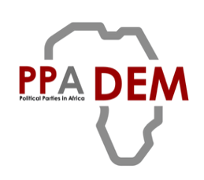

<p align="center">
  
</p>

# PPADEM Quarto Theme

Quarto themes and starter templates for the PPADEM project. Three themes are included:

| Format | Use it for | Format name |
| --- | --- | --- |
| **Website** | Quarto project sites | `ppadem-theme-html` |
| **Report** | Standalone, self-contained HTML reports with numbered sections and a cover-style title block | `ppadem-report-html` |
| **Presentation** | Reveal.js slide decks with brand title styling, embedded logo, cards and badges | `ppadem-presentation-revealjs` |

All three use the official PPADEM brand palette (red `#990000`, teal `#298c8c`,
gold `#f1a226`, grey `#b8b8b8`) and the PPADEM logo.

## Quick start

You need [Quarto](https://quarto.org/docs/get-started/) (1.3 or later) installed.

1. **Install the themes** into your project folder:

   ```bash
   quarto add PPADEM/ppadem-theme
   ```

   This adds `_extensions/ppadem-theme/`, `_extensions/ppadem-report/` and
   `_extensions/ppadem-presentation/` to your project. To pick up later theme changes,
   run the same command again.

2. **Start from a template** (optional, see below), or add a `format:` line to any
   `.qmd` file.

3. **Render**:

   ```bash
   quarto render my-report.qmd
   ```

## Templates

Starter documents live in [`_extensions/templates/`](_extensions/templates/):

| Template | Format |
| --- | --- |
| `report.qmd` | Report |
| `presentation.qmd` | Presentation |
| `website.qmd` | Website |

Each one is a worked example that shows the layout and components for its format.
Replace the text with your own content.

Download a template without cloning the repo:

```bash
curl -O https://raw.githubusercontent.com/PPADEM/ppadem-theme/main/_extensions/templates/report.qmd
```

Change `report.qmd` to `presentation.qmd` or `website.qmd` for the others. If you have
already run `quarto add`, copy the template from your project instead:

```bash
cp _extensions/templates/report.qmd my-report.qmd
```

The `templates` folder starts with an underscore, so Quarto ignores it when you run
`quarto render` on a project. The templates are never rendered by accident.

## Using a theme without a template

Set the format in the YAML front matter of any `.qmd` file:

```yaml
---
title: My document
format: ppadem-report-html
---
```

Use `ppadem-theme-html` for a website page or `ppadem-presentation-revealjs` for slides.

You can also choose the format when you render:

```bash
quarto render document.qmd --to ppadem-theme-html
quarto render document.qmd --to ppadem-report-html
quarto render document.qmd --to ppadem-presentation-revealjs
```

## Components

The website and presentation themes include reusable content classes from the PPADEM
brand design. Use them in a fenced div in any `.qmd`:

```md
::: {.ppadem-card-grid}
...
:::
```

- `.ppadem-hero` / `.ppadem-pill`: page hero banner and pill label.
- `.ppadem-highlights-strip` / `.ppadem-highlight-tag` (optional `.teal` / `.gold`):
  stat badges strip.
- `.ppadem-card-grid` / `.ppadem-card` / `.card-link`: card grid with a link.
- `.workstream-grid` / `.workstream-item` (optional `.teal` / `.gold`) /
  `.workstream-num` / `.workstream-title` / `.workstream-desc`: numbered workstream grid.
- `.highlight-teal` / `.highlight-gold` / `.highlight-red`: inline colour highlights.
- `.placeholder-box`: dashed placeholder box for sections in progress.

The templates in `_extensions/templates/` show these in use.

## License

The source code in this repository is licensed under the MIT License (see [LICENSE](LICENSE)). The PPADEM logo
is the property of the PPADEM project and is not covered by the MIT licence.
